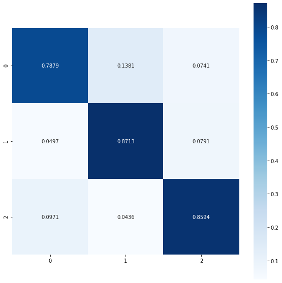
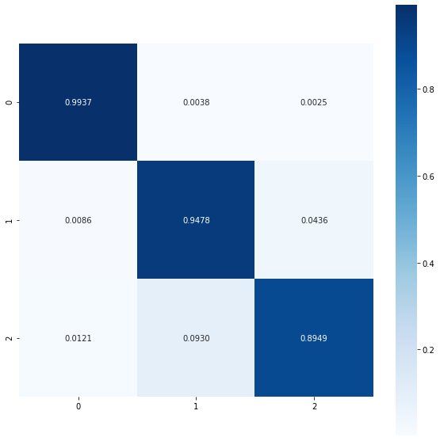

# Human Activity Recognition using OpenPose

[OpenPose](https://github.com/CMU-Perceptual-Computing-Lab/openpose) is an open source library used for multi-person keypoint detection. 
This project is to use the keypoints obtained from OpenPose detection on images, and predict whether a person is standing or sitting.


## Getting Started

### OpenPose Library Installation
Please refer to the installation guide: https://github.com/CMU-Perceptual-Computing-Lab/openpose/blob/master/doc/installation.md

### Clone Repository
```
git clone https://github.com/weichee98/Human-Activity-Recognition.git
```

### Requirements
- [OpenCV](https://pypi.org/project/opencv-python/)
- [numpy](https://numpy.org/install/)
- [scipy](https://www.scipy.org/install.html)
- [pandas](https://pandas.pydata.org/pandas-docs/stable/getting_started/install.html)
- [TensorFlow 2.0](https://www.tensorflow.org/install) or later
- [Keras](https://pypi.org/project/Keras/)


## Directory Structure

The main directory in this project is [Human-Activity-Recognition](https://github.com/weichee98/Human-Activity-Recognition), which has the directory structure as below:
```
Human-Activity-Recognition
├── dataset
│   └── 20200527-174528-dataset.csv
|   └── 20200527-174528-dataset.pkl
├── images
│   └── COCO
|   └── Subway
├── model
│   └── 20200527115516
├── openpose
│   └── ...
├── utils
│   └── body25.py
│   └── file_path.py
│   └── image_processing.py
│   └── keypoint_tracker.py
│   └── log.py
│   └── openpose.py
│   └── pose_classifier.py
│   └── pose_estimator.py
│   └── utilities.py
├── videos
├── directory_test.py
├── generate_dataset.py
├── image_pose.py
├── rename_files.py
└── video_pose.py
```
The `openpose` directory shown in the directory structure above is the [OpenPose](https://github.com/CMU-Perceptual-Computing-Lab/openpose) directory cloned, 
which is not included in this repository

| Directory                                                                                         | Description                                                                                                                |
|---------------------------------------------------------------------------------------------------|----------------------------------------------------------------------------------------------------------------------------|
| [dataset](https://github.com/weichee98/Human-Activity-Recognition/tree/master/dataset)            | This directory contains a pickle file and a csv file, which is used for the training of the deep neural network classifier |
| [images](https://github.com/weichee98/Human-Activity-Recognition/tree/master/images)              | This directory contains the images used for testing purpose, and also the processed images after testing                   |
| [model](https://github.com/weichee98/Human-Activity-Recognition/tree/master/model/20200527115516) | This directory contains the deep neural network trained for classifying standing and sitting poses                         |
| [openpose](https://github.com/CMU-Perceptual-Computing-Lab/openpose)                              | This directory contains the OpenPose library                                                                               |
| [utils](https://github.com/weichee98/Human-Activity-Recognition/tree/master/utils)                | This directory contains important python modules                                                                           |
| [videos](https://github.com/weichee98/Human-Activity-Recognition/tree/master/videos)              | This directory contains the video files used for testing purposes, and also the processed video or images after testing    |


## Python Files

#### 1. [utils/body25.py](https://github.com/weichee98/Human-Activity-Recognition/blob/master/utils/body25.py)

This file contains functions designed for processing keypoints.
| Function              | Description                                                                  |
|-----------------------|------------------------------------------------------------------------------|
| `getCoordinates`      | Get the coordinates of certain parts of the body                             |
| `getScore`            | Get the probability score of certain parts of the body                       |
| `getAverageScore`     | Get the average score of the keypoints                                       |
| `getCentroid`         | Get the centroid of keypoints                                                |
| `getFrameCoordinates` | Get the frame coordinates to create box on images capturing the person       |
| `normalizeKeypoint`   | Get the normalized keypoints, whereby the coordinates are scaled from 0 to 1 |

#### 2. [utils/image_processing.py](https://github.com/weichee98/Human-Activity-Recognition/blob/master/utils/image_processing.py)

This file contains functions used for adding text or boxes to images.
| Function                      | Description                                               |
|-------------------------------|-----------------------------------------------------------|
| `outputIndividualPoseToImage` | Show whether a person is sitting or standing in the image |
| `outputNumberOfPeopleToImage` | Show the number of people in the image                    |
| `outputIndividualIdToImage`   | Show the id of a person in the image                      |

#### 3. [utils/keypoint_tracker.py](https://github.com/weichee98/Human-Activity-Recognition/blob/master/utils/keypoint_tracker.py)

This file contains functions used for tracking the position of a person in consecutive frames (not completed).

#### 4. [utils/openpose.py](https://github.com/weichee98/Human-Activity-Recognition/blob/master/utils/openpose.py)

This file is used to load the openpose library for simplicity. File paths must be changed if your directory structure is different from the one in the repository.

#### 5. [utils/pose_classifier.py](https://github.com/weichee98/Human-Activity-Recognition/blob/master/utils/pose_classifier.py)

This file contains functions used to predict whether a person is sitting, standing or unknown.
| Function            | Description                                                     |
|---------------------|-----------------------------------------------------------------|
| `predictPoseModel`  | Use trained deep neural network to predict the pose of a person |
| `predictPoseBody25` | Use rule-based classifier to predict the pose of a person       |

#### 6. [utils/pose_estimator.py](https://github.com/weichee98/Human-Activity-Recognition/blob/master/utils/pose_estimator.py)

This file contains functions used to retrieve the keypoints from OpenPose library.
| Function                | Description                                                                                                                                    |
|-------------------------|------------------------------------------------------------------------------------------------------------------------------------------------|
| `processImage`          | Pass in the image for OpenPose to process                                                                                                      |
| `getOutputImage`        | Get the display of skeletons of all detected person in the image processed by OpenPose                                                                 |
| `getPoseKeypoints`      | Get the posture keypoints, refer to [OpenPose](https://github.com/CMU-Perceptual-Computing-Lab/openpose/doc/output.md) for more information    |
| `getFaceKeypoints`      | Get the face keypoints, refer to [OpenPose](https://github.com/CMU-Perceptual-Computing-Lab/openpose/doc/output.md) for more information       |
| `getLeftHandKeypoints`  | Get the left hand keypoints, refer to [OpenPose](https://github.com/CMU-Perceptual-Computing-Lab/openpose/doc/output.md) for more information  |
| `getRightHandKeypoints` | Get the right hand keypoints, refer to [OpenPose](https://github.com/CMU-Perceptual-Computing-Lab/openpose/doc/output.md) for more information |
| `setFace`               | Set whether face keypoints are detected or not                                                                                                 |
| `setHand`               | Set whether hand keypoints are detected or not                                                                                                 |
| `setParams`             | Set whether face and hand keypoints are detected or not                                                                                        |

#### 7. [utils/utilities.py](https://github.com/weichee98/Human-Activity-Recognition/blob/master/utils/utilities.py)

This file contains mathematical functions that are commonly used

#### 7. [directory_test.py](https://github.com/weichee98/Human-Activity-Recognition/blob/master/directory_test.py)

This file is used to predict the pose (sitting, standing or unknown) of people in all images in the directory.

#### 8. [generate_dataset.py](https://github.com/weichee98/Human-Activity-Recognition/blob/master/generate_dataset.py)

This file is used to generate augmented images for training of deep neural network

#### 9. [image_pose.py](https://github.com/weichee98/Human-Activity-Recognition/blob/master/image_pose.py)

This file contains a class `ImagePose`, which is used to analyze an image, and all the person detected in the image, and classify them as sitting, standing or unknown. 
The method `analyze` consists of the whole pipeline to process an image and get the output from it.

#### 10. [video_pose.py](https://github.com/weichee98/Human-Activity-Recognition/blob/master/video_pose.py)

This file contains a class `VideoPose`, which is used to analyze a video, frame-by-frame, detect people who exists in the frame and classify them as sitting, standing or unknown. 
The method `analyze` consists of the whole pipeline to process a video frame-by-frame and get the output from it.


## Results

### Pose Classifier

The image above shows the image after being processed using the `analyze` method of `ImagePose` class available in `image_pose.py`


### Comparing Rule-Based Classifier and Deep Neural Network Classifier Performance

The number and its pose representation are as the table below
| Number | Pose       |
|--------|------------|
| `0`    | `UNKNOWN`  |
| `1`    | `SITTING`  |
| `2`    | `STANDING` |

Here are the confusion matrices for classifying poses using rule-based classifier and deep neural network classifier
| Rule-Based Classifier | Deep Neural Network Classifier |
|-----------------------|--------------------------------|
|   |           |

We can see that the overall accuracy for deep neural network classifier is higher than the accuracy of rule-based classifier, which implies that the deep neural network classifier is able to detect features that are not obviously seen to us.


### Keypoint Tracking

The GIF above shows the result of keypoint tracking frame by frame.


## References
- https://github.com/CMU-Perceptual-Computing-Lab/openpose
